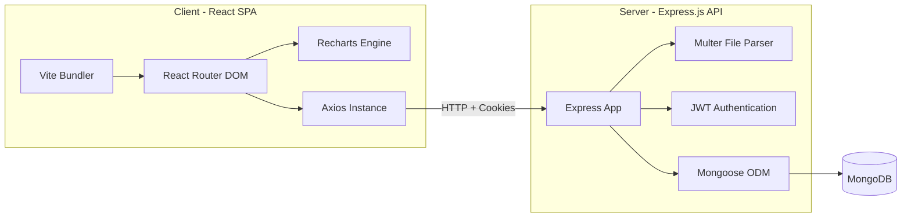

# KMG Training Management System (TMS) - Project Documentation

This document provides a comprehensive technical overview, setup guide, architecture breakdown, and interface reference for the **KMG Training Management System (TMS)**.

---

## 1. Project Overview & Business Value

The **KMG Training Management System (TMS)** is a enterprise web portal designed to record, track, audit, and analyze training activities across the organization. It acts as a single point of truth for training records, replacing fragmented spreadsheets and manual tracking sheets.

### Core Value Drivers:
1. **Automation of Data Entry**: Denormalized schemas auto-fetch staff information from the master staff list using their unique staff numbers.
2. **Bulk Processing Engine**: Asynchronous Excel/CSV parsing engine that validates hundreds of rows of staff or training logs, separates successes from errors, and provides downloadable error sheets.
3. **Advanced Analytical Reports**: High-fidelity dashboard widgets and specific report routes (Monthly, Quarterly, Financial Year, Group-Wise, Staff-Wise, Cost Analysis, and Beneficiary coverage) driven by Recharts visualizations.
4. **Governance & Compliance**: Dynamic Audit System logs all records creations, modifications, exports, and authentications along with IP address logging and diff-comparison states.

---

## 2. System Architecture & Technology Stack

The application is structured as a decoupled client-server web app:



### 2.1 Technology Stack Details:
* **Frontend**:
  * **Framework**: React.js (Vite compiler).
  * **Routing**: React Router DOM (v6) implementing layout wrappers and role-based guards.
  * **Styles**: Vanilla CSS + Tailwind CSS utilities for responsive, mobile-first design.
  * **Charts**: Recharts library.
  * **HTTP Client**: Axios with interceptors for global JWT management and token refreshes.
* **Backend**:
  * **Runtime**: Node.js with Express.js.
  * **Database**: MongoDB utilizing Mongoose ODM.
  * **Parsing & Worksheets**: `exceljs`, `xlsx` (SheetJS), and `csv-parser`.
  * **Security**: Helmet, CORS, Express Mongo Sanitize, rate limiters, and `bcryptjs`.
  * **Exports**: `pdfmake` for dynamic PDF report generation.

---

## 3. Database Schema Models

The database contains 6 primary MongoDB collections:

### 3.1 User Model (`User`)
Stores admin and super-admin credentials.
* `staffNumber` (String, unique, indexed): Unique identifier.
* `name` (String, required)
* `email` (String, unique, lowercase, indexed)
* `passwordHash` (String, required): Bcrypt hash.
* `role` (String, enum: `['super_admin', 'admin']`)
* `isActive` (Boolean, default: true)
* `isDeleted` (Boolean, default: false)

### 3.2 Staff Model (`Staff`)
The master directory of all employees in the organization.
* `staffNumber` (String, unique, indexed): Primary identifier.
* `staffName` (String, required)
* `emailId` (String, lowercase)
* `designation` (String)
* `groupName` (String): e.g. Engineering, Finance.
* `productDivisionCategory` (String): e.g. Cloud Solutions.
* `reportingGLManagerName` (String)
* `employmentStatus` (String, enum: `['Currently Serving', 'Resigned', 'Retired']`)
* `dateOfJoining` (Date)
* `superannuationDate` (Date)
* `isDeleted` (Boolean, default: false)

### 3.3 Training Record Model (`TrainingRecord`)
Tracks individual training histories. Employs snapshot denormalization of staff fields.
* **Staff Snapshot**: `staffNumber` (indexed), `staffName`, `emailId`, `designation`, `groupName`, `productDivisionCategory`, `reportingGLManagerName`, `employmentStatus`, `dateOfJoining`, `superannuationDate`.
* **Training Details**:
  * `trainingTopic` (String, required)
  * `trainingModuleNumber` (String, required, indexed)
  * `trainerName` (String)
  * `trainingInstituteName` (String)
  * `typeOfTraining` (String, enum)
  * `trainingMode` (String, enum)
  * `trainingDurationHours` (Number, min: 0)
  * `startDateOfTraining` (Date, indexed)
  * `endDateOfTraining` (Date)
  * `requestProcessedDate` (Date, indexed)
  * `trainingStatus` (String, enum: `['Completed', 'Not Completed', 'Scheduled', 'In Progress', 'Cancelled', '-']`)
  * `trainingCostPerPerson` (Number, default: 0)
  * `remarks` (String)
* **Metadata**: `uploadBatchId` (indexed), `isDeleted` (indexed), `createdBy`/`updatedBy`/`deletedBy` (User references).
* **Compound Unique Index**: `{ staffNumber: 1, trainingModuleNumber: 1, startDateOfTraining: 1 }` (prevents duplicate logs).

### 3.4 Upload Batch Model (`UploadBatch`)
Logs bulk file imports.
* `batchId` (String, unique, indexed): UUID.
* `fileName` (String)
* `uploadedBy` (ObjectId, ref: 'User')
* `batchType` (String, enum: `['training', 'staff']`)
* `totalRows` / `successCount` / `errorCount` / `duplicateCount` (Numbers)
* `errors` / `duplicates` (Arrays of objects storing row numbers, validation error messages, and raw data).
* `status` (String, enum: `['processing', 'completed', 'failed']`)

### 3.5 Master Data Model (`MasterData`)
Dynamic lists for selectors (designations, departments, divisions, groups, training types).
* `type` (String, enum): e.g. `department`.
* `value` (String): Display value.
* `isActive` (Boolean, default: true)

### 3.6 Audit Log Model (`AuditLog`)
Compliance tracking ledger.
* `userId` (ObjectId, ref: 'User') / `userEmail` (String).
* `action` (String, enum: `['CREATE', 'UPDATE', 'DELETE', 'LOGIN', 'LOGOUT', 'EXPORT', 'BULK_UPLOAD']`).
* `module` (String): e.g., `training`, `staff`.
* `recordId` (ObjectId)
* `before` / `after` (Mixed): Delta state fields.
* `ipAddress` (String)
* `timestamp` (Date, default: Date.now).

---

## 4. Setting Up & Running the Application

### 4.1 Prerequisites
* **Node.js**: v18+ (includes `npm`)
* **MongoDB**: Local Community Server instance or Atlas URI connection.

### 4.2 Local (Windows) Configuration & Start
1. **Database Seeding**:
   Navigate to `/server` and seed initial database states (creates the super admin credentials `superadmin@kmg.com` with password `Admin@1234`):
   ```powershell
   cd server
   npm run seed
   ```
2. **Start Backend**:
   ```powershell
   npm run dev
   ```
3. **Start Frontend**:
   ```powershell
   cd ../client
   npm run dev
   ```

### 4.3 Production (Linux Server) Deployment Configuration
When running the application on a network server, you can use the automated `migrate-linux.sh` script or setup PM2 to run both the frontend and backend applications in the background.

#### 1. Automated Setup via `migrate-linux.sh`
A helper script is provided in the project root to automate dependency installation, configuration file setup, and database seeds:
```bash
chmod +x migrate-linux.sh
./migrate-linux.sh
```

#### 2. Process Management via PM2
PM2 is the recommended process manager for Node.js workloads under Linux. The root directory contains an autogenerated `ecosystem.config.js` configuration file:

* **Start both services**:
  ```bash
  pm2 start ecosystem.config.js
  ```

* **Restart frontend service**:
  ```bash
  pm2 restart kmg-tms-frontend
  ```

* **Restart backend service**:
  ```bash
  pm2 restart kmg-tms-backend
  ```

* **Restart all services**:
  ```bash
  pm2 restart all
  ```

* **Check status & view logs**:
  ```bash
  pm2 status
  pm2 logs
  ```

---

## 5. Navigation & Page Map Details

Below is a detailed guide to every page and route configuration in the application:

### 5.1 Public Routes
* **Login (`/login`)**:
  * Input fields for Email and Password. 
  * Automatically redirects authenticated sessions to the Dashboard.
  * Captures login IP address and writes entries to the `AuditLog` collection.
  * Forces routing to password reset if the database flag `mustChangePassword` is active.
* **Change Password (`/change-password`)**:
  * Input fields for Old Password, New Password, and Confirm Password.
  * Performs length and complexity validations before database writes.

### 5.2 Protected Core Pages (Requires Authentication)
All core routes render within the `AppLayout` wrapper which provides a collapsable sidebar navigation, navbar breadcrumbs, user profile widget, and responsive layout scaling.

#### 5.2.1 Dashboard (`/dashboard`)
* **KPI Metric Cards**:
  1. *Records*: Total courses logged.
  2. *Trained*: Unique count of staff members with at least one record.
  3. *Hours*: Aggregate training hours.
  4. *Cost*: Total financial budget (uses currency format helper).
  5. *Coverage %*: Trained staff relative to active staff master list.
  6. *Completed*: Successfully finished course counts.
* **Analytics Visualizations**:
  * *Monthly Trend (Bar Chart)*: Real-time Recharts bar graph comparing total courses against cumulative hours.
  * *Status Breakdown (Pie Chart)*: Colorful slices showing training statuses (Green for Completed, Red for Not Completed, Gray for Cancelled).
  * *Coverage by Group (Horizontal Bar Chart)*: Dynamic rankings of departments based on trained employee coverage.

#### 5.2.2 Training Records Module
* **Records List (`/training`)**:
  * Tabular directory listing all active course logs.
  * Fully paginated backend query interfaces with instant search (Topic, Module #, Staff Name) and filters.
  * Allows downloading filtered rows to Excel or PDF.
* **Add Record (`/training/add`)**:
  * Inputting a valid `Staff Number` automatically invokes an API call to resolve and auto-populate designation, department, division, and employment status.
  * Integrated dynamic dropdown selectors linked to `MasterData`.
* **Edit Record (`/training/:id/edit`)**:
  * Safe edit layout. Saves old and new values to the Audit Log database to maintain changes history.
* **View Record (`/training/:id/view`)**:
  * Non-editable overview panel. Shows record creator and timestamp metadata.

#### 5.2.3 Staff Master Directory
* **Staff List (`/staff`)**:
  * Tabular directory of employees. Includes search and filters.
* **Add Staff (`/staff/add`)**:
  * Manual creation of employee records (restricted to Super Admin & Admin roles).
* **Edit Staff (`/staff/:id/edit`)**:
  * Modifies employee info. Includes changing employment status to Retired or Resigned (which prompts date inputs).
* **Import Staff (`/staff/import`)**:
  * Exposes drag-and-drop zone to import employee lists.

#### 5.2.4 Bulk Upload Module (`/bulk-upload`)
* **Process Flow**:
  1. *Template selection*: Links to download template sheets in XLSX or CSV.
  2. *Dropzone area*: Accepts drag-and-drop file uploads up to 10MB.
  3. *Background parsing*: Uploading a file starts background processing. The UI displays a progress wheel and polls status from `/api/v1/upload/status/:batchId` every 2 seconds.
  4. *Upload batch review*: Renders counts of successful, failed, and duplicate rows. Exposes error report download links.
* **Batch History (`/bulk-upload/history`)**:
  * Lists previous upload transactions.
* **Batch Details (`/bulk-upload/history/:batchId`)**:
  * Lists parsing errors row-by-row (e.g. `Row 45: Invalid End Date`).

#### 5.2.5 Reports Module
Dynamic reporting layouts compiling tabular grids with export capabilities:
1. **Monthly Report (`/reports/monthly`)**: Month-by-month breakdown of courses, hours, coverage, and costs.
2. **Quarterly Report (`/reports/quarterly`)**: Groups data by fiscal quarters (Q1, Q2, Q3, Q4).
3. **FY Report (`/reports/financial-year`)**: Compares trends across financial years.
4. **Staff-Wise (`/reports/staff-wise`)**: Aggregates courses, hours, and costs per individual employee. Features expandable rows displaying course histories.
5. **Group-Wise (`/reports/department-wise`)**: Departmental comparison reports.
6. **Cost Analysis (`/reports/cost-analysis`)**: Financial analytics report showing costs-per-person.
7. **Training Status (`/reports/training-status`)**: Aggregates records by execution status.
8. **Beneficiaries (`/reports/beneficiaries`)**: Tracks training reach across employee segments.

#### 5.2.6 Admin Configurations (Super Admin Only)
* **Master Data (`/master`)**:
  * Interface containing tabs for configuring Designations, Departments, Divisions, Group Names, and Training Types.
* **User Management (`/users`)**:
  * Grid directory listing system administrators. Super Admins can add new administrators, edit roles, or toggle account statuses.
* **Audit Logs (`/audit`)**:
  * Read-only table logs all administrator actions. Features expandable row panels revealing the raw before/after JSON structures.
* **Settings (`/settings`)**:
  * Dynamic configurations for Organization Branding title, session variables, and password rules.
